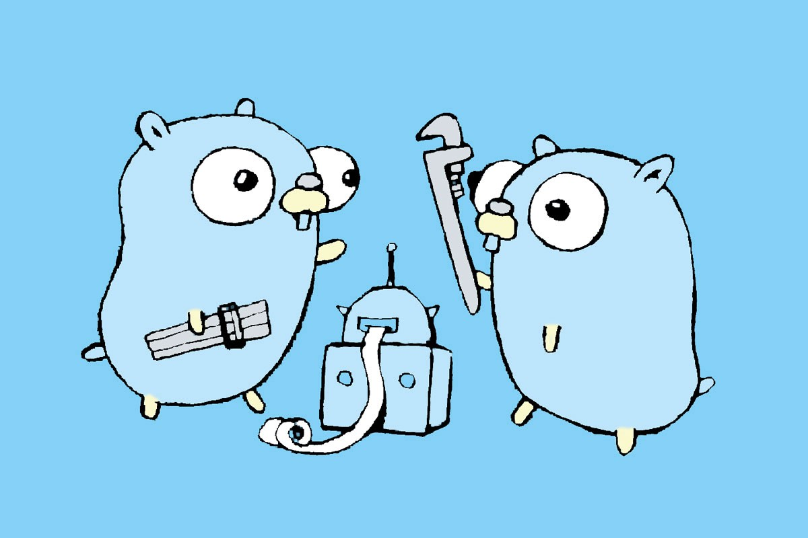

# hezzlTest
 
## Task description

1. Describe the proto file with the service from 3 methods: add user, delete user, list of users

2. Implement a gRPC service based on a proto file on Go

3. Use PostgreSQL for data storage

4. upon request for a list of users, the data will be cached in redis for a minute and taken from radish

5. When adding a user, make a log in ClickHouse

6. Add logs to ClickHouse via Kafka queue

## Solution notes

- :book: standard Go project layout (well, more or less :blush:)
- :cd: github CI/CD + docker compose + Makefile included
- :white_check_mark: tests with mocks included

## HOWTO

- run service with tests and client `make run`
- in client type kind of operation (create (then the number of users to create), delete (to delete user type id), all (show all saving users), ch (show logs from clickhouse), exit)
- run service without client `make up`
- run tests `make test`

